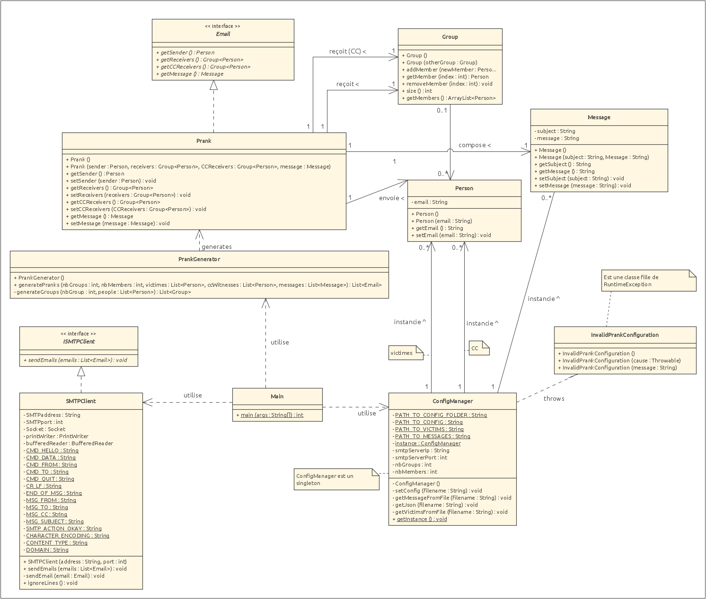

# RES_LABO3

## DESCRIPTION :mailbox_with_mail: 
Dans le cadre de notre cours RES, nous avons dû réaliser un programme qui permet de réaliser une campagne de prank par e-mail,
c'est-à-dire, envoyer une série des par courrier électronique à plusieurs groupes de personnes en usurpant à chaque fois
l'identité d'un des membres de ces groupe pour envoyer l'e-mail le faisant ainsi passé pour l'expéditeur.


## DOCKER :whale2:
Pour mocker notre serveur SMTP, nous avons utilisé [MockMock](https://github.com/tweakers/MockMock).
Ce serveur est serveur se lance via un `jar` et, nous avons créé une image docker automatisant tout ça.

Configuration par défaut du serveur MockMock : 
| PROTOCOLE | PORT |
|-----------|------|
| SMTP      | 2500 |
| HTTP      | 8080 |

Et bien évidemment, vous pouvez changer ces ports à votre guise. Pour ce faire, référez vous aux fichiers [docker-compose.yml](MockMockDocker/docker-compose.yml) et [mock_server.Dockerfile](MockMockDocker/mock_server.Dockerfile).    
*Dans la balise port du docker-compose.yml vous trouverez la ligne "port1:port2". port1 correspond au port ouvert chez l'hôte et le port:2 au port ouvert dans le container*.

Ainsi, pour lancer le docker, il vous suffit de vous déplacer dans le dosser `MockMockDocker`, puis de lancer la commande suivante :   
```
docker compose up
```   
et vous avez un serveur SMTP qui tourne en local ! :sunglasses:

## COMPAGNE DE PRANK :fire:
Voici les étapes pour lancer une campagne de prank : 
1. Cloner ce repository.
2. Avoir accès à un serveur SMTP. Par exemple MockMock.
3. 


```
git clone https://github.com/EricBroutba/RES_LABO3.git
cd RES_LABO3
mvn clean install
mvn exec:java
```
4. Editer les fichiers de configuration (dans le dossier `/config` ):
    * config.json contient divers configurations notamment les infos du serveur SMTP.
      ```json
      {
        "nbGroups": 3,                                // Nombre de groupes à créer
        "nbMembers" : 3,                              // Nombre de personnes minimum dans un groupe
        "smtpServerIp": "localhost",                  // Adresse du serveur SMTP
        "smtpServerPort" : 2500,                      // Port du serveur SMTP à utiliser
        "witnessesCC": ["ilias.gougjali@gmailc.socm"] // Adresses e-mails des témoins (CC)
      }
      ```
    * messages.json contient les pranks/messages qui seront utilisés
        ```json
            [
                {
                    "title": "Un titre",               // Titre du prank
                    "content": "Un contenu du message" // Contenu du prank
                },
                ...                                    // Ajouter d'autre prank
            ]
      ```
    * victimes.json contient les adresses e-mails des vitimes
      ```json
      [
         "tillman.austin@hotmail.com", // adresses e-mails des victimes
         "brussel@hotmail.com"
          ...
         ]
      ```

Et la compagne de prank devrait être fonctionnelle 

## IMPLÉMENTATION :mag:
### UML

Ci-dessus, l'UML de notre programme. Voici un descriptif des classes des plus importantes:
* <i>ConfigManager</i> permet la lecture et le stockage des différents fichiers de configuration nécessaire au fonctionnement de l'application.
* <i>PrankGenerator</i> permet de générer des pranks. Ceci en formant des groupes avec les victimes et les messages fournit en paramètre
* <i>Prank</i> est la représentation d'un e-mail qui est une blague. Il contient notamment l'expéditeurs, les destinataire et le contenu de l'e-mail.
* <i>SMTPClient</i> est la classe qui se charge d'envoyer le prank/email a proprement dit. Elle se connecte au serveur SMTP en utilisant les paramètres fournit(provenant du ConfigManager)


### Fonctionement
Au lancement de l'application, la classe <i>Main</i> se charge d'instancier le <i>ConfigManager</i>. Ce dernier va lire et stocker tous les fichiers de configuration.
Ensuite, ces informations sont données au <i>PrankManager</i> qui se chargera de créer les <i>Prank</i>s. Enfin, les pranks sont envoyé par SMTPClient
